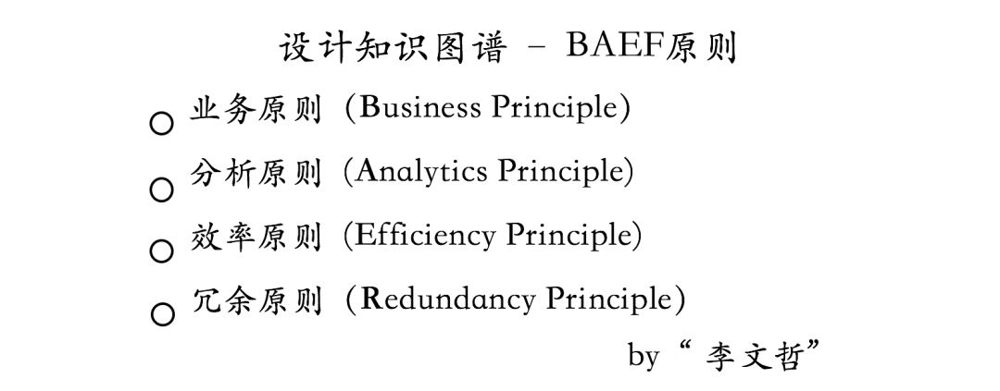

## 1、概论

随着移动互联网技术的快速发展，实现了万物互联的可能性，伴随而来的是数据量的爆炸式增长。这些海量数据不仅提供了分析单个实体的机会，更重要的是，它们为分析实体间复杂关系提供了丰富的资源。在移动互联网时代，除了对单一个体的分析，个体间的相互关系分析成为了研究的一个重要方向。特别是在需要关系分析的场景中，知识图谱技术显得尤为重要，它不仅有能力描绘出实体之间的多维度联系，还能在众多应用场景中发挥重要作用。简而言之，知识图谱的应用潜力在于其对于复杂关系网络的有效解析与应用。

## 2、什么是信息和知识？

在探索知识图谱的领域之前，理解信息与知识的区别是关键。信息可以被看作是关于外部世界的客观事实的描述。例如，描述一瓶水的温度为7°C就是一条信息。而知识，则进一步基于信息，通过归纳和总结外部世界的客观规律。比如，知识可以是对水冰点的总结，即水在0°C时会结冰。

在深入了解的过程中，Quora上的一个经典解释帮助我们更好地区分了信息与知识。这种区分强调了信息是知识构建的基础：通过建立事实（或称为信息）之间的联系，我们能形成知识。在这个框架下，知识图谱展现为一系列知识的集合，其中每一项知识都可以被表示为一个SPO三元组（主体-谓语-宾语）。这不仅帮助我们理解事实如何转化为知识，而且也揭示了知识图谱如何将这些知识组织起来，形成了一个丰富的、互相连接的信息网络，使我们能够更深入地探索和利用知识。

## 3、什么是知识图谱？

### （1）发展

实际上，知识图谱并不是一个全新的概念，早在 2006 年就有文献提出了语义网（Semantic Network）的概念，呼吁推广、完善使用本体模型来形式化表达数据中的隐含语义，RDF（resource description framework，资源描述框架）模式和 OWL（Web ontology language，万维网本体语言）就是基于上述目的产生的。用电子科技大学徐增林教授的论文原文来说：知识图谱技术的出现正是基于以上相关研究，是对语义网标准与技术的一次扬弃与升华。

知识图谱是由Google公司在2012年提出来的一个新的概念，主要是用来优化现有的搜索引擎，增强用户搜索质量及体验。不同于基于关键词搜索的传统搜索引擎，知识图谱可用来更好地查询复杂的关联信息，从语义层面理解用户意图，改进搜索质量。

### （2）定义

从学术的角度，我们可以对知识图谱给一个这样的定义：知识图谱本质上是语义网络，是一种基于图的数据结构，由节点(Point)和边(Edge)组成。在知识图谱里，每个节点表示现实世界中存在的“实体”，比如人、地名、概念、药物、公司等。关系则用来表达不同实体之间的某种联系。比如“人”-“居住在”-“北京”、张三和李四是“朋友”、逻辑回归是深度学习的“先导知识”等等。通俗地讲，知识图谱就是把所有不同种类的信息（Heterogeneous Information）连接在一起而得到的一个关系网络。知识图谱提供了从“关系”的角度去分析问题的能力，是关系的最有效的表示方式。

从实际应用的角度出发其实可以简单地把知识图谱理解成多关系图（Multi-relational Graph）。多关系图一般包含多种类型的节点和多种类型的边。知识图谱以结构化的形式描述客观世界中概念、实体及其关系，是在计算机世界中表示认知世界和物理世界中信息和知识的有效载体。

现实世界中的很多场景非常适合用知识图谱来表达。比如一个社交网络图谱里，我们既可以有“人”的实体，也可以包含“公司”实体。人和人之间的关系可以是“朋友”，也可以是“同事”关系。人和公司之间的关系可以是“现任职”或者“曾任职”的关系。类似的，一个风控知识图谱可以包含“电话”、“公司”的实体，电话和电话之间的关系可以是“通话”关系，而且每个公司它也会有固定的电话。
 

### （3）基本单位

在知识图谱中，基本单位的概念主要涉及实体、关系和属性的概念。这些单位共同构成了知识图谱的框架，使其能够有效地组织和表达复杂的信息。

#### 1）实体 (Entity)

实体是知识图谱中的基础元素，代表了可以独立存在并具有可区分性的事物。实体可以是具体的对象，如人、城市、植物、商品等，也可以是抽象的概念。实体通过关系与其他实体相连，共同构成更广泛的网络。

#### 2）关系 (Relationship)

关系是连接两个实体的桥梁，表达了实体之间的各种相互作用和联系。关系的定义通常是定向的，表示从一个实体（源实体）到另一个实体（目标实体）的某种语义连接，如“首都”、“拥有”等。关系的类型繁多，其具体性质取决于所连接的实体及其上下文。

#### 3）属性 (Attribute)

属性用于描述实体的具体特征，帮助区分不同的实体或概念。属性可以分为两大类：

- **数据属性**：直接关联到具体的值，如数字、文本等。例如，城市的“面积”、“人口”等。
- **对象属性**：链接到另一个实体或概念，表达实体之间的关系。例如，“首都”可以看作是国家（一个实体）到城市（另一个实体）的对象属性。

#### 4）概念 (Concept)

概念是一组具有共同特性的实体的集合，通常用于分类和组织实体。例如，“国家”、“民族”、“书籍”和“电脑”等都可以视为概念。概念有助于在更高的层次上理解和分析知识图谱中的信息。

### （4）为什么用知识图谱？

#### 1）明确使用知识图谱的必要性

在决定是否采用知识图谱技术之前，重要的是要明确知识图谱是否真的适合解决特定的业务问题。虽然知识图谱在处理复杂关系和语义查询方面有明显优势，但不是所有数据处理需求都需要这样高级的工具。有时候，传统的数据库系统足以满足需求，特别是在关系相对简单且数据结构固定的情况下。

#### 2）知识图谱的优势

- **复杂关系的建模和查询**：

知识图谱非常适合处理和查询复杂的实体关系网络。例如，在生物医药、金融风控或推荐系统中，实体之间的关系可能非常复杂且信息量巨大，传统数据库在这种情况下可能难以高效地管理和查询。

- **语义搜索和增强决策支持**：

知识图谱通过理解实体间的语义关系，可以提供比关键字搜索更为丰富和精准的搜索结果。此外，它们还能支持更复杂的决策支持系统，通过关联和推理增强信息的价值。

- **数据整合和多源数据融合**：

知识图谱能够整合来自多个源的数据，并通过统一的模型提供对这些数据的访问。这对于需要从多个数据源抽取并整合信息的场景尤为重要。

- **自然语言处理与人机交互**：

知识图谱在自然语言处理领域内应用广泛，能够帮助改善机器理解人类语言的能力，提供更自然的交互体验。例如，通过知识图谱支持的聊天机器人可以更准确地理解用户意图并提供相关信息。

#### 3）技术选型的考量

在选择是否使用知识图谱时，应考虑以下因素：

- **数据的复杂性**：如果业务涉及多层次、多维度的关系数据，知识图谱可能是一个好的选择。
- **查询的需求**：如果需要进行复杂的查询，如跨多个维度的关联查询或深层次的逻辑推理，传统数据库可能难以高效支持。
- **长期的维护和扩展性**：知识图谱的结构使其更易于扩展和维护，特别是在数据模型和业务需求频繁变化的情况下。

选择知识图谱应基于对业务需求、数据特性和未来发展的深入理解。这样的选择将有助于企业更有效地利用数据，推动业务的增长和创新。

## 4、知识图谱的应用场景

知识图谱因其能够复杂处理数据和关系而广泛应用于多个领域。以下是一些主要的应用场景：

### （1）搜索引擎优化
知识图谱可以提升搜索引擎的效果，使其不仅能够返回关键词匹配的结果，还能理解查询的语义意图和上下文。例如，谷歌使用知识图谱来提供更丰富、更准确的搜索结果，如直接显示名人的生平信息、地点的详细数据等。

### （2）推荐系统
在电商、媒体流媒体和内容推荐平台上，知识图谱能够帮助系统更好地理解用户的兴趣和行为模式。通过分析用户与产品、内容之间的关系，知识图谱可以提供更精准的个性化推荐。

### （3）企业知识管理
企业可以使用知识图谱来整合内部数据资源，如员工信息、项目文档、产品数据等。通过建立这些信息的相互关系，知识图谱帮助企业更有效地管理知识资产，提升决策效率和创新能力。

### （4）智能客服和聊天机器人
知识图谱使得聊天机器人和智能客服系统能够更好地理解用户问题并提供准确的答案。这是通过分析问题中的关键实体和它们之间的关系，从而检索出最相关的信息。

### （5）健康医疗
在健康医疗领域，知识图谱被用于整合患者的医疗记录、研究文献、临床试验等数据。医生和研究人员可以通过知识图谱更快地获取洞见，实现个性化医疗和更精确的病情分析。

### （6）金融风险分析
风控知识图谱，用来做风险控制，对于线上贷款的公司来说，最大的诉求点就是风控，需要准确地判断一个人的风险有多大，这样才能做出要不要给这个人贷款的决定。知识图谱最大的作用在于它可以从**关系的角度**去分析问题，从而找到一些潜在的风险。比如可以用下图去挖掘**团体欺诈**，这样的欺诈其实从一个审核人员的角度是很难去发现的。

### （7）证券知识图谱
当我们去买股票的时候，经常关心这样的问题，比如一个事件发生了可能会影响那些股票上涨或者下跌。这个问题的本质就是我们需要分析一个**事件**和一支**股票**或者**公司之间的关系**，这种关系可以从图谱里挖掘出来。再比如一个股票上涨了有哪些股票也会随之上涨，这跟问题的本质是我需要分析公司与公司之间潜在的关系。这样的关系也可以从这样的证券知识图谱中挖掘出来。

### （8）教育和学习
用知识图谱刻画知识点之间的关系：如下图。线性回归的后续知识是逻辑回归。这种知识图谱结合一些算法来判断学习技能的学习情况。

这些应用场景展示了知识图谱如何通过整合和分析大量信息来支持更智能的决策和服务，提升各行各业的效率和效果。

## 5、知识图谱的设计

图谱的设计是一门艺术，不仅要对业务有很深的理解、也需要对未来业务可能的变化有一定预估，从而设计出最贴近现状并且性能高效的系统。在知识图谱设计的问题上，我们肯定会面临以下几个常见的问题：

1. 需要哪些实体、关系和属性？
2. 哪些属性可以做为实体，哪些实体可以作为属性？
3. 哪些信息不需要放在知识图谱中？ 

基于这些常见的问题，我们从以往的设计经验中抽象出了一系列的设计原则。这些设计原则就类似于传统数据库设计中的范式，来引导相关人员设计出更合理的知识图谱系统，同时保证系统的高效性。

接下来，我们举几个简单的例子来说明其中的一些原则。 

首先是，`业务原则`（Business Principle），它的含义是 “一切要从业务逻辑出发，并且通过观察知识图谱的设计也很容易推测其背后业务的逻辑，而且设计时也要想好未来业务可能的变化”。

举个例子，可以观察一下下面这个图谱，并试问自己背后的业务逻辑是什么。通过一番观察，其实也很难看出到底业务流程是什么样的。做个简单的解释，这里的实体-“申请”意思就是application，如果对这个领域有所了解，其实就是进件实体。在下面的图中，申请和电话实体之间的“has_phone”，“parent phone”是什么意思呢？

接下来再看一下下面的图，跟之前的区别在于我们把申请人从原有的属性中抽取出来并设置成了一个单独的实体。在这种情况下，整个业务逻辑就变得很清晰，我们很容易看出张三申请了两个贷款，而且张三拥有两个手机号，在申请其中一个贷款的时候他填写了父母的电话号。总而言之，一个好的设计很容易让人看到业务本身的逻辑。

接下来再看一个原则叫做`效率原则`（Efficiency Principle）。效率原则让知识图谱尽量轻量化、并决定哪些数据放在知识图谱，哪些数据不需要放在知识图谱。在这里举一个简单的类比，在经典的计算机存储系统中，我们经常会谈论到内存和硬盘，内存作为高效的访问载体，作为所有程序运行的关键。这种存储上的层次结构设计源于数据的局部性-“locality”，也就是说经常被访问到的数据集中在某一个区块上，所以这部分数据可以放到内存中来提升访问的效率。 类似的逻辑也可以应用到知识图谱的设计上：我们把常用的信息存放在知识图谱中，把那些访问频率不高，对关系分析无关紧要的信息放在传统的关系型数据库当中。`效率原则的核心在于把知识图谱设计成小而轻的存储载体。`

比如在下面的知识图谱中，我们完全可以把一些信息比如“年龄”，“家乡”放到传统的关系型数据库当中，因为这些数据对于：a. 分析关系来说没有太多作用  b.  访问频率低，放在知识图谱上反而影响效率

另外，从`分析原则`（Analytics Principle）的角度，我们不需要把跟关系分析无关的实体放在图谱当中；从`冗余原则`（Redundancy Principle）的角度，有些重复性信息、高频信息可以放到传统数据库当中。

## 6、知识图谱的架构

知识图谱的架构主要包括自身的`逻辑架构`以及`体系架构`。

### （1）逻辑架构

知识图谱在逻辑结构上可分为模式层与数据层两个层次：

- **数据层**：主要包括众多事实，这些事实将以`事实`为单位存储。事实通常采用（实体1，关系，实体2）或（实体、属性、属性值）的三元组形式来表达，适合使用图数据库作为存储介质。例如，可以使用开源的Neo4j、Twitter的FlockDB、JanusGraph等图数据库。
  
  
  
- **模式层**：建立在数据层基础之上，构成知识图谱的核心部分。这一层主要通过本体库来规范数据层的事实表达。本体是一种结构化知识库的概念模板，通过本体库构建的知识库具有清晰的层次结构和较低的数据冗余。

### （2）技术架构

知识图谱的技术架构如下图所示：

以下是优化后的内容：

#### 1）数据源：
数据源包括以下几类：
- **授权数据**：用户明确授权我们使用的数据。
- **公开数据**：例如互联网上公开的黑名单等信息。
- **第三方数据**：通过API从其他服务提供者处获取的数据。
- **业务数据**：用户在业务系统中填写的个人信息等数据。

#### 2）数据处理机制：
**MySQL Binlog**：这是MySQL数据库自带的一种机制。每当MySQL数据库的数据发生更新时，相关的数据就会被写入Binlog，这为实时处理与离线增量导入架构提供了数据支持。

#### 3）数据架构流程：
**实时处理与离线增量导入架构**包括以下步骤：

- 使用Canal server（一种中间件）从MySQL Binlog捕捉数据变动。
- Canal client从Canal server接收数据，然后传输给Kafka Producer。
- Kafka Producer将数据推送到Kafka（一个消息队列系统）。
- Kafka Consumer从Kafka获取数据，通过Neo4j Driver将数据写入Neo4j数据库。
- 初始数据加载：使用MySQL Connector和APOC（一个Neo4j的工具库）将业务数据初始化到Neo4j数据库中。

#### 4）服务与算法应用：
- **Restful API**：提供服务接口，用于业务系统访问，并应用Spark GraphX算法处理数据。
- **数据算法处理**：
  - 在MySQL中对非结构化数据进行自然语言处理（NLP），包括信息抽取、消歧分析等。
  - 在Neo4j中定义实体和关系，设计风控规则和规则库。
  - 实现简单的关系推理，包括在大规模复杂网络上进行分布式社区挖掘和在Spark GraphX中实现标签传播等算法。

## 7、知识图谱的构建方式

曾经知识图谱非常流行`自顶向下`(top-down)的构建方式。（所谓自顶向下构建是借助百科类网站等结构化数据源，从高质量数据中提取本体和模式信息，加入到知识库中）自顶向下指的是先为知识图谱定义好本体与数据模式，再将实体加入到知识库。该构建方式需要利用一些现有的结构化知识库作为其基础知识库，例如 Freebase 项目就是采用这种方式，它的绝大部分数据是从维基百科中得到的。

然而目前，大多数知识图谱都采用`自底向上`(bottom-up)的构建方式。自底向上指的是从一些开放链接数据（也就是 “信息”）中提取出实体，选择其中置信度较高的加入到知识库，再构建实体与实体之间的联系。

## 8、知识图谱的挑战

### （1）数据的噪声

首先，数据中存在着很多的噪声。即便是已经存在库里的数据，我们也不能保证它有100%的准确性。在这里主要从两个方面说起。

第一，目前积累的数据本身有错误，所以这部分错误数据需要纠正。 最简单的纠正办法就是做离线的不一致性验证。

第二， 数据的冗余。比如借款人张三填写公司名字为”普惠“，借款人李四填写的名字为”普惠金融“，借款人王五则填写成”普惠金融信息服务有限公司“。虽然这三个人都隶属于一家公司，但由于他们填写的名字不同，计算机则会认为他们三个是来自不同的公司。那接下来的问题是，怎么从海量的数据中找出这些存在歧义的名字并将它们合并成一个名字？ 这就涉及到自然语言处理中的”消歧分析”技术。

### （2）非结构化数据处理能力

在大数据时代，很多数据都是未经处理过的非结构化数据，比如文本、图片、音频、视频等。特别在互联网金融行业里，往往会面对大量的文本数据。怎么从这些非结构化数据里提取出有价值的信息是一件非常有挑战性的任务，这对掌握的机器学习，数据挖掘，自然语言处理能力提出了更高的门槛。

### （3）知识推理

推理能力是人类智能的重要特征，使得我们可以从已有的知识中发现隐含的知识，一般的推理往往需要一些规则的支持 。例如“朋友”的“朋友”，可以推理出“朋友”关系，“父亲”的“父亲”可以推理出“祖父”的关系。再比如张三的朋友很多也是李四的朋友，那我们可以推测张三和李四也很有可能是朋友关系。当然，这里会涉及到概率的问题。当信息量特别多的时候，怎么把这些信息（side information）有效地与推理算法结合在一起才是最关键的。常用的推理算法包括基于逻辑（Logic） 的推理和基于分布式表示方法（Distributed Representation）的推理。随着深度学习在人工智能领域的地位变得越来越重要，基于分布式表示方法的推理也成为目前研究的热点。

## 9、总结

> 大数据、小样本、构建有效的生态闭环是关键

虽然现在能获取的数据量非常庞大，我们仍然面临着小样本问题，也就是样本数量少。

假设我们需要搭建一个基于机器学习的反欺诈评分系统，我们首先需要一些欺诈样本。但实际上，我们能拿到的欺诈样本数量不多，即便有几百万个贷款申请，最后被我们标记为欺诈的样本很可能也就几万个而已。这对机器学习的建模提出了更高的挑战。每一个欺诈样本我们都是以很高昂的“代价”得到的。随着时间的推移，我们必然会收集到更多的样本，但样本的增长空间还是有局限的。这有区别于传统的机器学习系统，比如图像识别，不难拿到好几十万甚至几百万的样本。

在这种小样本条件下，构建有效的`生态闭环`尤其的重要。所谓的生态闭环，指的是构建有效的自反馈系统使其能够实时地反馈给我们的模型，并使得模型不断地自优化从而提升准确率。为了搭建这种自学习系统，我们不仅要完善已有的数据流系统，而且要深入到各个业务线，并对相应的流程进行优化。这也是整个反欺诈环节必要的过程，我们要知道整个过程都充满着博弈。所以我们需要不断地通过反馈信号来调整我们的策略。

从技术来说，知识图谱的难点在于 NLP，因为我们需要机器能够理解海量的文字信息。但在工程上，我们面临更多的问题，来源于知识的获取，知识的融合。搜索领域能做的越来越好，是因为有成千上万（成百万上亿）的用户，用户在查询的过程中，实际也在优化搜索结果，这也是为什么百度的英文搜索不可能超过 Google，因为没有那么多英文用户。知识图谱也是同样的道理，如果将用户的行为应用在知识图谱的更新上，才能走的更远。

知识图谱肯定不是人工智能的最终答案，但知识图谱这种综合各项计算机技术的应用方向，一定是人工智能未来的形式之一。